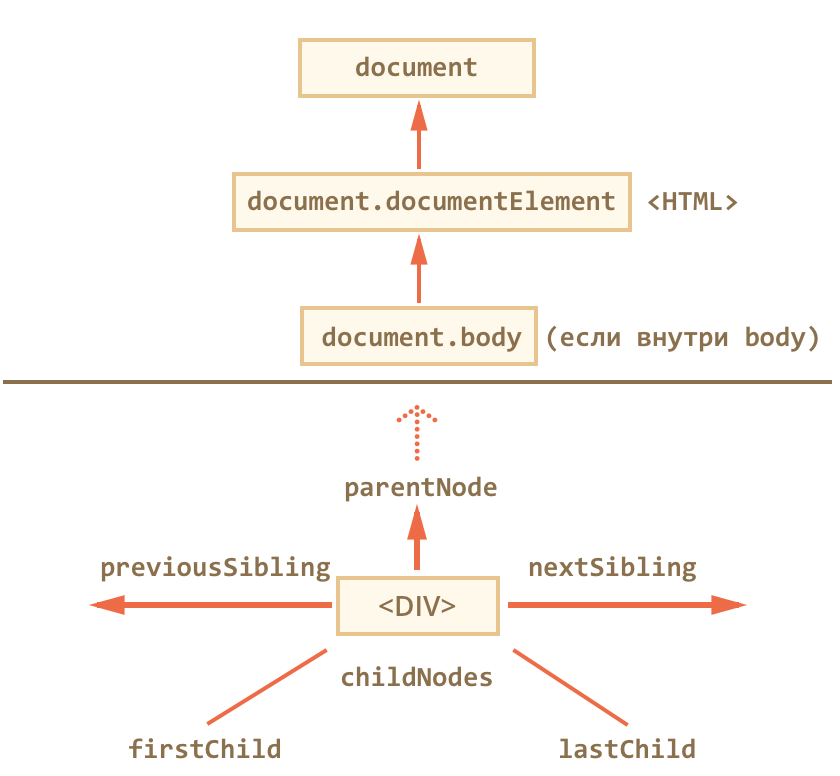
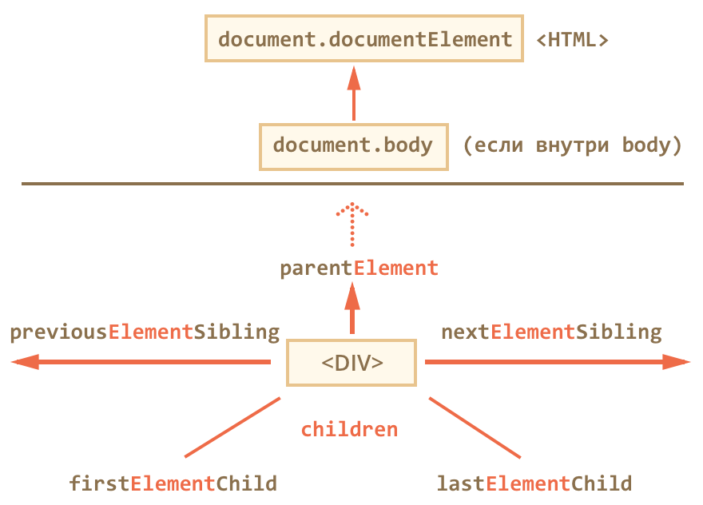
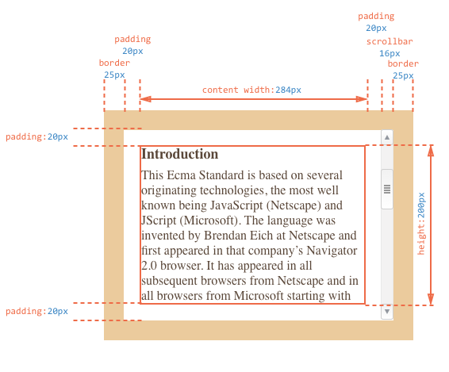

# Метки для break/continue

```
outer: for (var i = 0; i < 3; i++) {

  for (var j = 0; j < 3; j++) {

    var input = prompt('Значение в координатах '+i+','+j, '');

    // если отмена ввода или пустая строка -
    // завершить оба цикла
    if (!input) break outer; // (*)

  }
}
```

---

# Функция из строки


`var sum = new Function('a,b', ' return a+b; ');`
`var sum = new Function('a', 'b', ' return a+b; ');`

this для new Function всегда = window
---

# Методы строк

* toUpperCase, toLowerCase
* charAt(n) Разница между [] и charAt в том, что если символа нет – charAt выдает пустую строку, а скобки – undefined
* indexOf(substr [, beginpos]) возвращает позицию, на которой находится подстрока или -1, если ничего не найдено
* lastIndexOf ищет с конца
* Взятие подстроки: substring(start [, end]), substr(begin [, length]), slice == substring, но отрицательные аргументы отсчитываются от конца
* str.split(s) : mas
* String.fromCharCode(n) : string n - код символа


чит - ~str.indexOf('substr) вернет 0 если substr найдено


# Методы чисел

* toFixed(n) - округление до n знаков после запятой и возврат в виде строки
* toString(система счисления)
* toLocaleString() красивый вывод числа


# Методы объектов

* if ('hi' in obj) есть ли у obj свойство hi если свойство объекта не строка он приведет его к строке
* Object.keys(obj) вернет все ключи obj

# Методы массивов

* arr.join(str) : str
* delete mas[i]
* arr.splice(index [, elemCount [, elem1, elem2..]])
* slice(begin [, end]);
* sort(func)
* reverse
* arr.concat(arr1, arr2, arr3..) arri = arr | value
* arr.[last]indexOf(elem [, begin]) возвращает первый elem из arr или -1

### Высокоуровневые

* forEach(callback [, thisArg]) для каждого элемента вызывает callback(item, i, arr), где thisArg - контекст для callback (callback.call(thisArg))
* filter(callback [, thisArg]) возвращает новый массив для которого callback(item, i, arr) вернет true
* map(callback [, thisArg]) трансформация массива, вернет новый массив из callback(item, i, arr) для каждого элемента
* every/some(callback [, thisArg]) вернет true если для всех/одного callback(item, i, arr) вернет true
* reduce(callback [, initValue]) вычисляет единый результат для массива callback(previousValue, currentItem, index, arr) если есть initValue, то previousValue ля 1 элемента = initValue, если нет, то перебор начинается со 2 элемента

---

проверка на nan - isNan(), nan != nan
проверка на конечность isFinite()

---

# Операторы

|| возвращает arg1 если он может быть преобразрван к true, иначе arg2

---

Мягкое преобразование к числу - parseInt(num, система счисления), parseFloat()

---

# Функции

* Доступ ко всем аргументам через arguments: function a(a) {console.log(arguments[1])} a(1, 2) // 2 + изменения arguments не влияет на аргументы (с use strict)
* Удобная передача аргументов function a(o){} a({o1: 1, o2: 2})

## Лексическое окружение

Все переменные внутри функции – это свойства специального внутреннего объекта **LexicalEnvironment**, который создаётся при её запуске.

При запуске функция создает объект LexicalEnvironment, записывает туда аргументы, функции и переменные. Процесс инициализации выполняется в том же порядке, что и для глобального объекта, который, вообще говоря, является частным случаем лексического окружения.

Интерпретатор, при доступе к переменной, сначала пытается найти переменную в текущем LexicalEnvironment, а затем, если её нет – ищет во внешнем объекте переменных.

Такой порядок поиска возможен благодаря тому, что ссылка на внешний объект переменных хранится в специальном внутреннем свойстве функции, которое называется [[Scope]]. Это свойство закрыто от прямого доступа, но знание о нём очень важно для понимания того, как работает JavaScript.

**У функции есть доступ к свои свойствам: `function a() {a.s++}`**

Иногда свойства, привязанные к функции, называют «статическими переменными». В некоторых языках программирования можно объявлять переменную, которая сохраняет значение между вызовами функции. В JavaScript ближайший аналог – такое вот свойство функции.

**Замыкание – это функция вместе со всеми внешними переменными, которые ей доступны.**

**Исключение** При создании функции с использованием new Function, её свойство [[Scope]] ссылается не на текущий LexicalEnvironment, а на window.

Внутри функций this == window, в use strict this == undefined

this вне функций == window все зависимости от use strict

стремная потеря контекста https://learn.javascript.ru/object-methods
---

# Преобразования

Для преобразования объекта к числу используется valueOf, к строке - toString

['x'] == 'x' // true

[] == [] //false
[] == ![] //true


# Основы работы со свойствами объекта

* Основной метод для управления свойствами – Object.defineProperty.
* Object.defineProperties(obj, descriptors) позволяет указать несколько свойств
* Object.keys(obj) - возвращает перечисляемые свойства, Object.getOwnPropertyNames(obj) - возвращает все свойства
* Object.getOwnPropertyDescriptor(obj, prop) возвращает дескриптор
* Object.preventExtensions(obj) запрещает добавление новых свойств в объект
* Object.seal(obj) запрещает добавление и удаление свойств, все текущие свойства делает configurable: false.
* Object.freeze(obj) запрещает добавление, удаление и изменение свойств, все текущие свойства делает configurable: false, writable: false.
* Object.isExtensible(obj) возвращает false, если добавление свойств объекта было запрещено вызовом метода Object.preventExtensions
* Object.isFrozen, Object.isSealed - то же самое

> Он позволяет объявить свойство объекта и, что самое главное, тонко настроить его особые аспекты, которые никак иначе не изменить.

> `Object.defineProperty(obj, prop, descriptor)`

### descriptor

* value - значение свойства, по умолчанию undefined
* writable значение можно менять, если true. По умолчанию false
* configurable - если true, то свойство можно удалять, а также менять вызовами Object.defineProperty, по умолчанию false
* enumerable - если true, то свойство видно через for..in и в Object.keys, по умолчанию false
* get - функция, которая возвращает значение свойства, по умолчанию undefined
* set - функция, которая устанавливает значение свойства, по умолчанию undefined

Чтобы избежать конфликта, запрещено одновременно указывать значение value и функции get/set. Либо значение, либо функции для его чтения-записи, одно из двух. Также запрещено и не имеет смысла указывать writable при наличии get/set-функций.

```
Object.defineProperty(a, 'fullname', {
  get: function() {
    return this.name + this.sur;
  }
});
alert(a.fullname) // name + sur
```

позволяет обращаться к свойству fullname, при этом fullname - функция, можно записать так

```
let a = {
  get fullname: function() {
    return this.name + this.sur;
  }
};
```

# Static

Статическое свойство `function a() {a.s}`
Статический метод `function a() {a.s = function}`

---

# Указание контекста

* func.call(context, arg1, arg2 ...);
* func.apply(context, args)

Пример одалживания метода `[].reduce.call(arguments, (sum, e) => sum += e, 0);`
Как просто сделать массив из arguments (и из коллекции) `[].slice.call(arguments);`

*В старом стандарте при передаче контекста null, undefined функция получает window, с use strict передается как есть*

---

### Привязка контекста и карринг

* func.bind(context [, arg1, arg2...])

*при вызове a = func.bind(context, arg1, arg2); a(arg11, arg12) будет вызвано func(arg1, arg2, arg11, arg12)*

Карринг (currying) или каррирование – термин функционального программирования, который означает создание новой функции путём фиксирования аргументов существующей.

*пример*

```
let mul = (a, b) => a * b;
let double = mul.bind(null, 2);
double(123) //246
```

# Декораторы

*Декоратор – приём программирования, который позволяет взять существующую функцию и изменить/расширить ее поведение.*

Пример: декоратор-таймер

```
function timingDecorator(f, timer) {
  if (!timingDecorator.timers) timingDecorator.timers = {};
  return function() {
    var start = performance.now();
    var result = f.apply(this, arguments); // (*)
    if (!timingDecorator.timers[timer]) timingDecorator.timers[timer] = 0;
    console.log(timingDecorator.timers);
    timingDecorator.timers[timer] += performance.now() - start;
    return result;
  }
}
```

# Типы данных

Определить тип переменной:
* оператор typeof, но для [], [], Date выводит object
* Array.isArray(arr)
* obj instanceof func - оператор, возвращает true, если объект или предок создан с помощью этой функции
Разделить можно с помощью следующего приема
```
{}.toString.call([]) //[object Array]
{}.toString.call(new Date) //[object Date]
```

### Интервалы

* setTimeout(func, delay [, arg1, arg2...])

---

Запуск кода из строки - eval(code)

---

**Поточнее посмотреть JSON**

# Перехват ошибок

Try .. catch .. finally

*Если код в блоке try синтаксически неверен, то try .. catch не сработает*
*Catch не поймает ошибку в функции, работающей асинхронно по отношению к catch*

### Объект ошибки

name - имя ошибки
message - текстовое сообщение
stack - стэк функций

Оператор throw - throw new Error(message)

Типы объектов ошибок: Error общий, SyntaxError, ReferenceError, RangeError ...

Finally выполняется всегда, кроме случаев с синтаксической ошибкой, даже если try {return 1;}

Как поймать ошибку все блока - window.onerror = function(message, url, lineNumber){}

# Proto

`__proto__` ([[Prototype]]) - специальная ссылка на объект (прототип), в котором будет искаться свойство, если не найдено в оригинальном
**__proto__ используется только при чтении и выполнении**
**for .. in выводит свойства прототипа, чтобы понять, принадлежит ли свойство именно объекту, нужно выполнить obj.hasOwnProperty(prop)**
**Создание объекта с прототипом - Object.create(proto, descriptors), Object.create(null) создает объект без прототипа**

Чтобы новым объектам автоматически ставить прототип, конструктору ставится свойство prototype.

При создании объекта через new, в его прототип __proto__ записывается ссылка из prototype функции-конструктора.

*prototype существует только у конструктора*

У каждой функции изначально есть свойство prototype, в него записано constructor: [имя функции] - легко теряется

*Фишечка* - можно записать в String.prototype функцию repeat и можно будет использовать ее со всеми строками

---

# ES6

## Spread оператор

Параметры по умолчанию могут быть не только значениями, но и выражениями.
function a(b = t()) {}

Можно использовать spread вместо arguments, при этом spread создает массив
function a(a, b, ...rest) {}

Spread можно использовать для вызова функций math.max(...args)

```
'use strict';
function showMenu({title="Заголовок", width:w=100, height:h=200} = {}) {
  alert(title + ' ' + w + ' ' + h);
}
showMenu(); // Заголовок 100 200
```

---

У функции добавилось свойство name - `function f() {} // f.name == "f"`

Функция в блоке не видна за блоком

Внутри функций стрелок this тот же что и снаружи

Есть тонкое различие между функцией стрелкой => и обычной функцией, у которой вызван .bind(this):
* Вызовом .bind(this) мы передаём текущий this, привязывая его к функции.
* При => привязки не происходит, так как функция стрелка вообще не имеет контекста this. Поиск this в ней осуществляется так же, как и поиск обычной переменной, то есть, выше в замыкании. До появления стандарта ES-2015 такое было невозможно.
* У функций стрелок нет arguments, this, super ищет в вышестоящей функции

---

## Строки шаблоны

В них разрешён перевод строки.

Можно вставлять выражения при помощи ${…}.

Можно использовать свою функцию шаблонизации (вроде не работает с многострочкой) а = func`qwe`, тогда будет вызвана функция func(strings, ...values), где strings - массив строк, разбитый по ${}, а values - массив значений в ${}. Также в strings есть strings.raw, где есть все строки в настоящем виде

добавлены методы String.fromCodePoint и str.codePointat для работы с суррогатными парами

Добавлены методы строк:
* Str.includes(s) - включает ли одна строка другую
* Str.endWith, str.startsWith
* Str.repeat

---

## Объекты

Добавлена деструктуризация при создании

```
let admin = 123;
Let user = {admin}
```

Вычисляемые свойства
Можно вставлять любые выражения

```
Let prop = 'hi'
Let o = {[prop]: '123'}
```

ES5 для прототипа был метод-геттер:
Object.getPrototypeOf(obj), В ES6 также добавился сеттер: Object.setPrototypeOf(obj, newProto), а также «узаконено» свойство __proto__

`Object.assign(target, src1, src2)` Копирует свойства из src в таргет, при этом последние перезаписывает предыдущие(можно использовать для 1 мерного клонировани)

Object.is(a,b) - почти то же, что ===, но nan is nan, +0 is not -0

Добавлены именно методы объекта `let o = {a(){}}` отличие - синтаксис и наличие свойства `[[HomeObject]]`
Так же можно объявлять сеттеры и геттеры `{set a(){}} o.a`

Появилось свойство super, работает только внутри методов (не свойств-методов, потому что от метода берется свойство homeobject) исключение функции стрелки, они ищут супер снаружи

Появились классы class a extends b {constructor(){}}
При вызове new вызывается конструктор, а все методы попадают в a.prototype
Class виден только в блоке, все методы работают в use strict даже без указания, методы не перечислимы.
Статические свойства class User { static man(){} static get a(){}} User.man()
User.a

---

## Symbol

Новый тип данных Symbol - примитив, все символы уникальны. Let a = Symbol('name'). Глобальный реестр символов - let a = Symbol.for('namr'), тогда можно его использовать в любых частях программы не передавая его. Есть обратный метод - Symbol.keysFor(a) // 'name'. Object.getOwnPropertySymbols возвращает символы объекта

---

## Iterator

Итераторы. Для итерируемых объектов добавлен цикл for of. Для возможности перебирание в объект нужно добавить свойство Symbol.iterator, при вызове которого он возвращает другой объект, который умеет осуществлять перебор, у него должен быть метод next, который возвращает очередное значение и проверяет окончен ли перебор. Spread вызывает итератор

---

## Map
В отличие от объектов ключами может быть что угодно, даже нан
Let m = new Map([[1, 2]])
M.set(1,4)
M.get(1)
M.size
M.delete(1)
M.clear()
M.has(key)

Итерации по Map
* Map.keys() - итерируемый объект для ключей
* Map.values() - итерируемый объект для значений
* Map.entries() - итерируемый объект для [ключ, значение]
Кроме того, у map есть forEach

---

## Set

* Set.add(item)
* Set.delete(item)
* Set.has(item)
* Set.clear()
* Set.forEach((item, againitem, set) => {})

### WeakMap WeakSet
особые типы Map, Set, не мешают сборщикам мусора удалять объекты, если они есть только там (ключами являются только объекты), но
* Нет clear, size
* Нельзя перебрать

---

# Promises
Promise – это специальный объект, который содержит своё состояние. Вначале pending («ожидание»), затем – одно из: fulfilled («выполнено успешно») или rejected («выполнено с ошибкой»).

Можно навешивать коллбеки 2х типов
* onFullfulled
* onRejected

Способ использования, в общих чертах, такой:

1. Код, которому надо сделать что-то асинхронно, создаёт объект promise и возвращает его.
1. Внешний код, получив promise, навешивает на него обработчики.
1. По завершении процесса асинхронный код переводит promise в состояние fulfilled (с результатом) или rejected (с ошибкой). При этом автоматически вызываются соответствующие обработчики во внешнем коде.

```
let p = new Promise((resolve, reject) => {
  resolve('all is well') // call fulfilled
  reject('not so good') // call rejected
});
p.then(
  result => console.log('fulfilled', result),
  err => console.log('rejected', err)
  );
```

Promise можно чейнить
Можно добавлять к 1 промису несколько обработчиков `p.then();p.then`

Можно выполнить параллельно несколько функций
1. Promise.all(iterable), получаем массив или другой итерируемый объект промисов и возвращает промис, который ждет, когда выполнятся все. Заметим, что если какой-то из промисов завершился с ошибкой, то результатом Promise.all будет эта ошибка. При этом остальные промисы игнорируются.
1. Promises.race(iterable) дождется выполнения первого промиса и вернет его результат
* Promises.resolve(value) создает успешный промис с результатом value
* Promise.reject(err) создает промис с ошибкой err

---

## Генераторы

Создается вызовом функции function* (){}, при вызове next() доходит до следующего yield и возвращает значение

```
function* () {
  yeld 1;
  yeld 2;
  yeld 3;
  return 4;
}
```

Другая форма - yield*, используется с другими генераторами, записать
```
function*() {
  yield* range(a, b);
}
```
Эквивалентна
```
function*() {
  for (let i = a; i < b; i++) yield i;
}
```

**yield может передавать в генератор значения**
```
function*(){
  let a = yield 1;
}
```
Для того, чтобы передать в генератор ошибку используется `gener.throw(err)`

---

# Proxy

Прокси (proxy) – особый объект, смысл которого – перехватывать обращения к другому объекту и, при необходимости, модифицировать их.

`let proxy = new Proxy(target, handler)`

Самые частые ловушки - get, set
* get(target, property, receiver)
* set(target, property, value, receiver)
* has(target, property, receiver) срабатывает при `in` (не for in)
* deleteProperty(target, property, receiver) срабатывает при delete, должна вернуть true, если успешно

Если target - функция, то доступно
* apply(target, thisArgument, argumentsList)
* construct(target, argumentsList) при вызове new

Полный список возможных функций-перехватчиков, которые может задавать handler:

* getPrototypeOf – перехватывает обращение к методу getPrototypeOf.
* setPrototypeOf – перехватывает обращение к методу setPrototypeOf.
* isExtensible – перехватывает обращение к методу isExtensible.
* preventExtensions – перехватывает обращение к методу preventExtensions.
* getOwnPropertyDescriptor – перехватывает обращение к методу getOwnPropertyDescriptor.
* defineProperty – перехватывает обращение к методу defineProperty.
* has – перехватывает проверку существования свойства, которая используется в операторе in и в некоторых других методах встроенных объектов.
* get – перехватывает чтение свойства.
* set – перехватывает запись свойства.
* deleteProperty – перехватывает удаление свойства оператором delete.
* enumerate – срабатывает при вызове for..in или for..of, возвращает итератор для свойств объекта.
* ownKeys – перехватывает обращения к методу getOwnPropertyNames.
* apply – перехватывает вызовы target().
* construct – перехватывает вызовы new target().

---

# DOM


dom объектная модель документа
bom объектная модель браузера
* navigator содержит общую информацию о браузере и ОС
* location содержит текущий url, через location можно перенаправлять

Переход по элементам с помощью ссылок:
childNodes хранит **дочерние** элементы, только для **чтения**
Следующие свойства включают текст и комментарии


Эти - только теги


---

## Tables

У таблицы есть особые ссылки
* table.rows - collection of tr of the table
* table.caption/tHead/tFoot - links for caption, tHead and tFoot of the table
* table.tBodies - collection of tBodies of the table, might be some according to specification
* tbody.rows - collection of rows of section tBody
* tr.cells – коллекция ячеек TD/TH
* tr.sectionRowIndex – номер строки в текущей секции THEAD/TBODY
* tr.rowIndex – номер строки в таблице
* td/th.cellIndex – номер ячейки в строке

---

## Другие способы получить elementNode

* document.getElementById(id) === id, так как если есть id, то создается переменная с именем id
* elem.getElementsByTagName(tagname)
* elem.getElementsByName(attributeName) - все элементы с атрибутом name
* elem.getElementsByClassName(className)
* elem.querySelectorAll(css)
* elem.querySelector(css)

---

### Другие методы работы с elementNode

* elem.matches(css) : bool
* elem.closest(css) ищет ближайщего родителя + себя, который удовлетворяет css

**XPath** - язык запросов для xml, неплохо поддерживается, более мощный чем css. Редко используется

**querySelector** - результат неживой, **getelemetby** - живойБ коллекция меняется при изменении dom

---

## DOM узлы

Классы dom образуют иерархию


Всего 12 типов узлов, htmlElement - 1, узнать тип узла - elem.nodeType
* htmlElem.nodeName/tagName - название тега
* htmlElem.innerHTML - содержимое элемента в строковом формате
* htmlElem.outerHTML - элемент вместе со своим содержимым в строковом формате - **только на чтение**, потому что элемент удаляется
* textElem.data - содержимое узла
* htmlElem.textContent - весь текст внутри элемента без тегов
* Атрибут hidden - то же, что и display: none `elem.hidden = true`
* value - свойство для input, select, textarea
* id - идентификатор
* href - адрес ссылки

---

* elem.hasAttribute(name) – проверяет наличие атрибута
* elem.getAttribute(name) – получает значение атрибута
* elem.setAttribute(name, value) – устанавливает атрибут
* elem.removeAttribute(name) – удаляет атрибут
* elem.attributes - получить весь список атрибутов элемента

**Для атрибута data- создается свойство**, например <a data-num="10" id="a"> `a.dataset.num == 10`

---

* `var result = parent.contains(child)` Возвращает true, если parent содержит child или parent == child.

* `var result = nodeA.compareDocumentPosition(nodeB)`

* 0 - a == b
* 1 - в разных документах
* 2 - b до a
* 4 - a до b
* 8 - a в b
* 16 - b в a
* 32 - зарезервировано

---

#### Создание элементов
* document.createElement(tag)
* document.createTextNode(text)

#### Добавление / удаление
* parent.appendChild(elem) - добавляет в конец
* parent.insertBefore(elem, nextSibling) - добавляет перед nextSibling

*Оба метода возвращают elem*

---
#### Клонирование

elem.cloneNode(bool)
Если передать true - глубокое клонирование со всеми атрибутами,
false - без дочерних элементов

---
#### Удаление
elem.remove() - новый метод (ie11- не работает)
parent.removeChild(elem)
parent.replaceChild(newElem, elem)

**Чтобы переместить элемент, достаточно вставить его на новое место, он автоматически удалиться со старого**

---

### Мультивставка
elem.insertAdjacent(where, html), где where -
* beforeBegin – перед elem.
* afterBegin – внутрь elem, в самое начало.
* beforeEnd – внутрь elem, в конец.
* afterEnd – после elem.

elem.insertAdjacentElement(where, newElem) – вставляет в произвольное место не строку HTML, а элемент newElem.
elem.insertAdjacentText(where, text) – создаёт текстовый узел из строки text и вставляет его в указанное место относительно elem.

**Это самые универсальные методы**

#### DocumentFragment

`var fragment = document.createDocumentFragment();`

DocumentFragment - не html узел, но в него можно вставлять html элементы с помощью обычных методов
Его «Фишка» заключается в том, что когда DocumentFragment вставляется в DOM – то он исчезает, а вместо него вставляются его дети. Это свойство является уникальной особенностью DocumentFragment.

### Новые методы для работы с узлами

* node.append(...nodes) – вставляет nodes в конец node,
* node.prepend(...nodes) – вставляет nodes в начало node,
* node.after(...nodes) – вставляет nodes после узла node,
* node.before(...nodes) – вставляет nodes перед узлом node,
* node.replaceWith(...nodes) – вставляет nodes вместо node.

Эти методы ничего не возвращают

### Стили

document.getComputedStyle(elem) - получить свойства элемента
document.getResolvedStyle(elem) - получить окончательные свойства элемента (в пикселях)

### Метрики




# События

###События мыши:

* click – происходит, когда кликнули на элемент левой кнопкой мыши
* contextmenu – происходит, когда кликнули на элемент правой кнопкой мыши
* mouseover – возникает, когда на элемент наводится мышь
* mousedown и mouseup – когда кнопку мыши нажали или отжали
* mousemove – при движении мыши

###События на элементах управления:
* submit – посетитель отправил форму <form>
* focus – посетитель фокусируется на элементе, например нажимает на <input>

Клавиатурные события:
* keydown – когда посетитель нажимает клавишу
* keyup – когда посетитель отпускает клавишу

События документа:
* DOMContentLoaded – когда HTML загружен и обработан, DOM документа полностью построен и доступен.

События CSS:
* transitionend – когда CSS-анимация завершена.

event.stopPropagation() - остановить всплытие
event.stopImmediatePropagation() - остановить всплытие и выполнение

# Генерация событий

`var event = new Event(тип события[, флаги]);`

* Тип события – может быть как своим, так и встроенным, к примеру "click".
* Флаги – объект вида { bubbles: true/false, cancelable: true/false }, где свойство bubbles указывает, всплывает ли событие, а cancelable – можно ли отменить действие по умолчанию.
* Флаги по умолчанию: {bubbles: false, cancelable: false}.

Затем, чтобы инициировать событие, запускается elem.dispatchEvent(event).

Для некоторых конкретных типов событий есть свои, специфические, конструкторы.
Вот список конструкторов для различных событий интерфейса которые можно найти в спецификации UI Event:

UIEvent
FocusEvent
MouseEvent
WheelEvent
KeyboardEvent
CompositionEvent
CustomEvent

Назначить несколько обработчиков можно только с помощью addEventListener(event, elem [, pseudo])
Убрать Обработчик - removeEventListener(event, elem [, pseudo])

### Порядок обработки событий

В каждом окне выполняется только один главный поток, который занимается выполнением JavaScript, отрисовкой и работой с DOM.Он выполняет команды последовательно, может делать только одно дело одновременно и блокируется при выводе модальных окон, таких как alert. *Есть и дополнительные потоки, например, сетевой*

**Существует спецификация, которая позволяет запускать дополнительные процессы (workers), они могут обмениваться сообщениями с главным потоком, но область переменных у них своя. Они полезны, например, при вычислениях, чтобы загрузить несколько процессоров**

Когда происходит событие, оно попадает в очередь

## События

Event.type - тип события
Event.currentTarget - элемент, на котором срабтал обработчик
Event.target - исходный элемент

Почти все события всплывают


Чтобы поймать событие на стадии перехвата, нужно использовать третий аргумент addEventListener:
Если аргумент true, то событие будет перехвачено по дороге вниз.
Если аргумент false, то событие будет поймано при всплытии.

#### Делегирование

Он заключается в том, что если у нас есть много элементов, события на которых нужно обрабатывать похожим образом, то вместо того, чтобы назначать обработчик каждому – мы ставим один обработчик на их общего предка. Из него можно получить целевой элемент event.target, понять на каком именно потомке произошло событие и обработать его.

#### Шаблон проектирования поведение

Приём проектирования «поведение» состоит из двух частей:

1. Элементу ставится атрибут, описывающий его поведение.
2. При помощи делегирования ставится обработчик на документ, который ловит все клики и, если элемент имеет нужный атрибут, производит нужное действие.

# RegExp

```
var regexp = new RegExp("шаблон", "флаги");
var regexp = /regexp/flags;
```

Флаги
* i Если этот флаг есть, то регэксп ищет независимо от регистра, то есть не различает между А и а.
* g Если этот флаг есть, то регэксп ищет все совпадения, иначе – только первое.
* m Многострочный режим.

Методы
* str.search(reg) : index ищет первое вхождение reg в str
* str.match(reg) : [match] (.index - start, .input - src str) без g
Если часть шаблона обозначена скобками, то она станет отдельным элементом массива.
* str.match(reg) : [matches] с g
* str.split(reg|substr, limit)
* str.replace(reg, str|func) заменяет 1 совпадение без g

Спецсимволы
$$	Вставляет "$".
$&	Вставляет всё найденное совпадение.
$\`	Вставляет часть строки до совпадения.
$'	Вставляет часть строки после совпадения.
$\*n\*	где n -- цифра или двузначное число, обозначает n-ю по счёту скобку, если считать слева-направо.

`alert(str.replace(/(Василий) (Пупкин)/, '$2, $1')) // Пупкин, Василий`

Для ситуаций, которые требуют максимально «умной» замены, в качестве второго аргумента предусмотрена функция.
Она будет вызвана для каждого совпадения, и её результат будет вставлен как замена.

```
alert("ОЙ-Ой-ой".replace(/ой/gi, function() {
  return ++i;
})); // 1-2-3
```
Эта функция получает следующие аргументы:

str – найденное совпадение,
p1, p2, ..., pn – содержимое скобок (если есть),
offset – позиция, на которой найдено совпадение,
s – исходная строка.
Если скобок в регулярном выражении нет, то у функции всегда будет ровно 3 аргумента: replacer(str, offset, s).

* regexp.test(str) : bool
* regexp.exec(str)
Если флага g нет, то regexp.exec(str) ищет и возвращает первое совпадение, является полным аналогом вызова str.match(reg).
Если флаг g есть, то вызов regexp.exec возвращает первое совпадение и запоминает его позицию в свойстве regexp.lastIndex. Последующий поиск он начнёт уже с этой позиции. Если совпадений не найдено, то сбрасывает regexp.lastIndex в ноль.

# Формы

Элементы формы можно получить с помощью document.forms[name/index]
Любой элемент формы можно получить так же с помощью form.elements[name/indx]
Если есть несколько элементов с одинаковым именем, вызов вернет коллекцию
Свойство  elements есть также у fieldset
По элементу можно получить его форму - elem.form

label - при клике на него происходи фокус на элементе, которому относиться label. Показать, к кому он относится можно с помощью:
1. Дать label атрибут for="elemid"
2. Завернуть elem в label

---

focus, blur, onfocus, onblur

---

атрибут tabindex позволяет выделить элемент с помощью tab. tabindex="n" - активируется через n нажатий tabindex="0" делает элемент всегда последним.
tabindex="-1" означает, что клавиша Tab будет элемент игнорировать.

---

События focus не всплывают, но их можно захватить на стадии **перехвата**, либо использовать focusin, focusout (не поддерживается в firefox)
